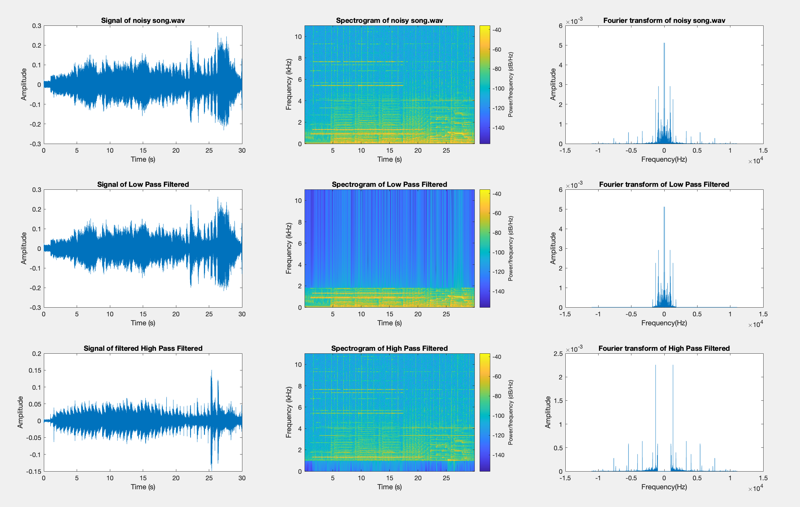

# Audio Signal Processing

## Overview

This part of the project demonstrates the fundamentals of audio signal processing using MATLAB. The goal is to analyze a given audio file, visualize its properties, and apply filtering techniques. The process involves generating spectrograms, applying high-pass and low-pass filters, and comparing the results.

## Task Details

1. **Audio File Analysis**
   - Read the provided `.wav` audio file.
   - Visualize the time-domain representation of the signal using the `plot` function.

2. **Spectrogram Generation**
   - Compute and display the spectrogram of the audio signal to analyze its frequency content over time.
   - Parameters such as window size, overlap, and FFT points are configured to create a meaningful visualization.
   - Analyze the frequency and time-domain relationships using the spectrogram.

3. **Filter Design and Application**
   - Design high-pass and low-pass filters using Fourier Transform techniques.
   - Apply these filters to the original audio signal.

4. **Output Visualization**
   - Save the filtered audio signals as separate `.wav` files.
   - Plot the spectrograms of the original and filtered signals side-by-side using the `subplot` function for comparison.
   - Analyze and interpret the differences in frequency content after filtering.

## Implementation Details

1. **Input Audio Signal**
   - The input audio file, `noisy_song.wav`, is loaded and its signal is plotted in the time domain.

2. **Spectrogram Generation**
   - A spectrogram of the original audio signal is generated to analyze its frequency content over time.

3. **Fourier Transform**
   - The Fourier Transform of the audio signal is computed using the `fft` and visualized in the frequency domain.
   - This step reveals the frequency spectrum of the audio signal.

4. **Low-Pass Filtering**
   - Frequencies above `1800 Hz` are attenuated by zeroing out corresponding frequencies in the Fourier Transform.
   - The filtered signal is reconstructed using the inverse Fourier Transform (`ifft`) and saved as `low_pass_filtered.wav`.
   - The spectrogram, time-domain signal, and frequency-domain representation of the low-pass filtered signal are plotted.

5. **High-Pass Filtering**
   - Frequencies below `1000 Hz` are attenuated using a similar process.
   - The filtered signal is reconstructed and saved as `high_pass_filtered.wav`.
   - The spectrogram, time-domain signal, and frequency-domain representation of the high-pass filtered signal are plotted.

## Outputs

The script produces the following results:

- **Filtered Audio Files**:
  - `low_pass_filtered.wav`
  - `high_pass_filtered.wav`

- **Visualizations**:
  - Time-domain signal of the original and filtered audio signals.
  - Spectrograms of the original and filtered audio signals.
  - Fourier Transform (frequency spectrum) of the original and filtered audio signals.

  This is the result of applying the filters:
  

## Key MATLAB Functions Used

- `audioread`: To load the input audio file.
- `plot`: To visualize signals in the time and frequency domains.
- `spectrogram`: To generate spectrograms for time-frequency analysis.
- `fft` and `ifft`: To compute and manipulate the Fourier Transform.

## Code Explanation

The implementation uses MATLAB's core functionalities to analyze and process the audio signal:
- The input signal is transformed to the frequency domain using the Fourier Transform.
- Low-pass and high-pass filters are applied by modifying the frequency domain representation of the signal.
- The filtered signals are transformed back to the time domain using the inverse Fourier Transform and saved as `.wav` files.

## Visual Organization

The script organizes visualizations into a `3x3` grid of subplots:
1. Original signal (time domain), spectrogram, and Fourier Transform.
2. Low-pass filtered signal (time domain), spectrogram, and Fourier Transform.
3. High-pass filtered signal (time domain), spectrogram, and Fourier Transform.

## Results and Insights

- The low-pass filter retains frequencies below `1800 Hz`, removing high-frequency noise.
- The high-pass filter retains frequencies above `1000 Hz`, isolating higher-frequency components.
- Spectrograms effectively visualize the changes in frequency content over time, demonstrating the impact of filtering.

## How to Run

1. Run `audio.m` script.
2. The filtered audio files will be saved in the working directory, and visualizations will be displayed.

Explore the `audio_processing/` directory for the MATLAB script and example outputs.
