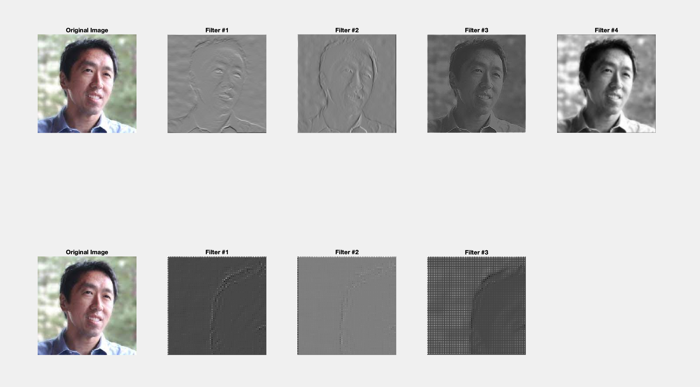
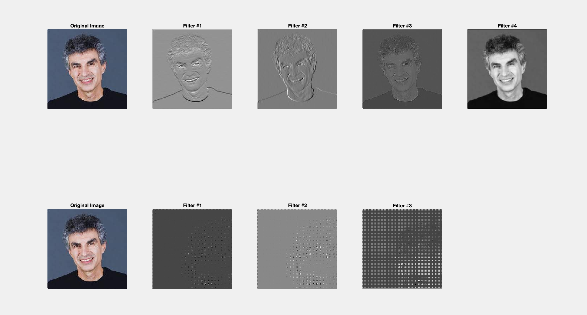
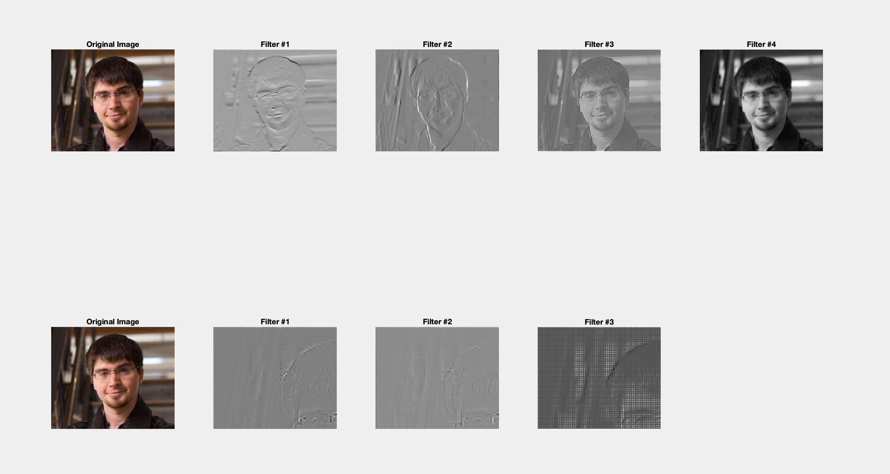
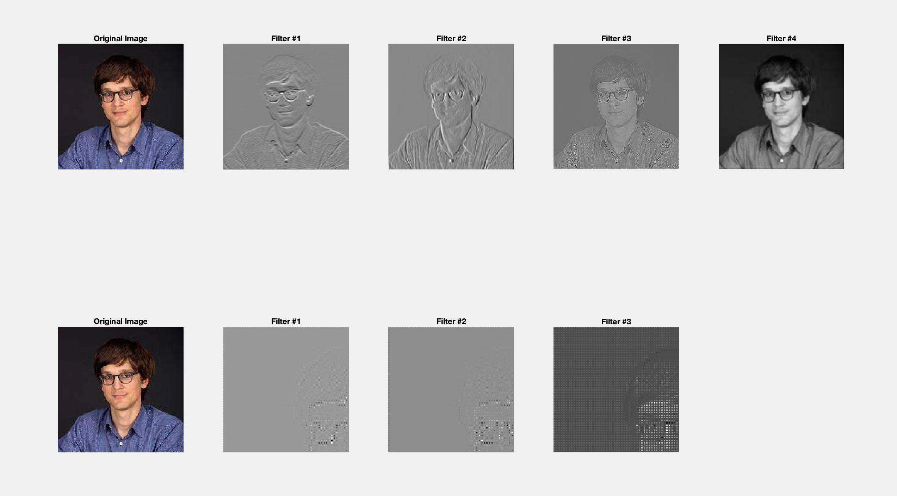

# Image Processing in Signals and Systems

## Overview

This component of the project demonstrates the application of custom 2D convolution filters to an image. The task involves implementing a convolution function, applying multiple filters to an input image, and visualizing the results across two layers of processing. This simulates the feature extraction process in Convolutional Neural Networks (CNNs).

## Implementation Details

1. **Custom 2D Convolution Function**
   - A custom MATLAB function (`conv2D`) is implemented to perform 2D convolution on an image.
   - Supports `stride` and `padding` parameters:
     - **`'same'` padding** ensures the output dimensions match the input dimensions.
     - **`'valid'` padding** removes edges to produce smaller feature maps.
   - Processes multi-channel images (e.g., RGB) by applying filters to each channel.

2. **Filter Design**
   - Layer 1 filters:
     - Horizontal edge detection.
     - Vertical edge detection.
     - Sharpening.
     - Weighted averaging (Gaussian-like blur).
   - Layer 2 filters:
     - Robert's cross filters for edge detection.
     - Averaging (2x2).

3. **Layer-wise Processing**
   - **Layer 1**:
     - Input: Original image.
     - Filters: Horizontal edge, vertical edge, sharpening, weighted averaging.
     - Output: Feature maps for each filter.
   - **Layer 2**:
     - Input: Layer 1 feature maps.
     - Filters: Robert's cross filters and averaging.
     - Output: Further processed feature maps.

4. **Visualization**
   - Original image and feature maps from both layers are displayed using `subplot`:
     - Layer 1 outputs are shown in the first row.
     - Layer 2 outputs are shown in the second row.

## Key MATLAB Functions

- **Custom Functions**:
  - `conv2D`: Implements 2D convolution with stride and padding support.
- **Built-in Functions**:
  - `imshow`: Displays images and feature maps.
  - `uint8` and `mat2gray`: Converts processed data to a displayable format.

## Outputs

- **Visualizations**:
  - Original image.
  - Feature maps generated by Layer 1 filters.
  - Feature maps generated by Layer 2 filters.
- **Image Processing Flow**:
  - Each filter's effect is shown step-by-step to demonstrate feature extraction.

## Results and Insights

- Layer 1 filters highlight basic features such as edges and intensity variations.
- Layer 2 filters focus on finer details by further processing Layer 1 outputs.
- The output visualizations provide an intuitive understanding of how convolutional layers extract hierarchical features from images.

### Andrew

### Bengio

### Goodfellow

### Leskovec

## How to Run

1. Run the `image.m` script in MATLAB.
2. The processed results will be displayed as a multi-row subplot.

## Notes

- This implementation avoids using external libraries to align with project requirements.
- Filters and their effects are demonstrated clearly through visual outputs.
